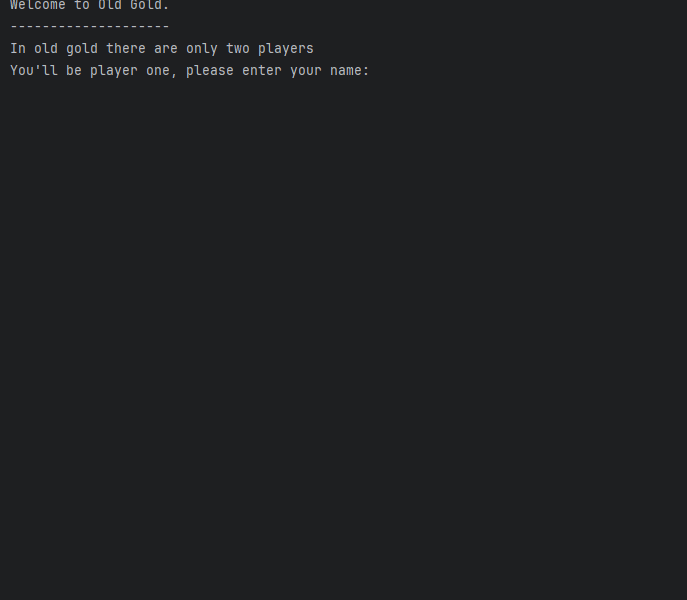
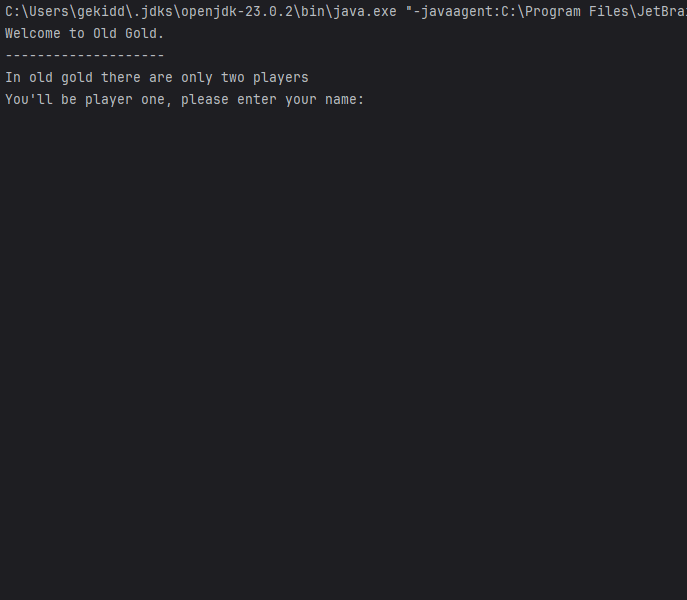
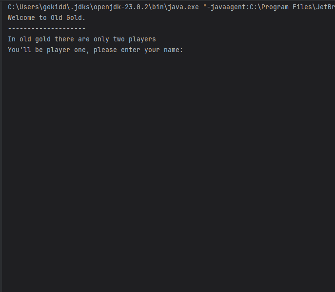
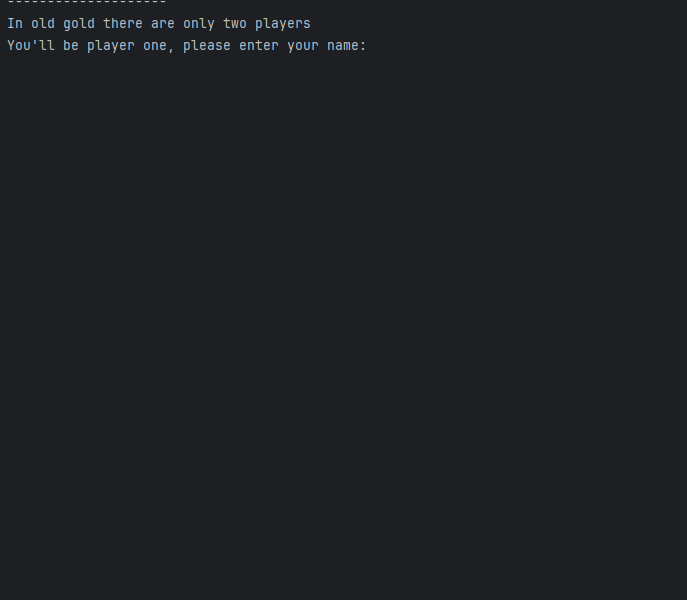
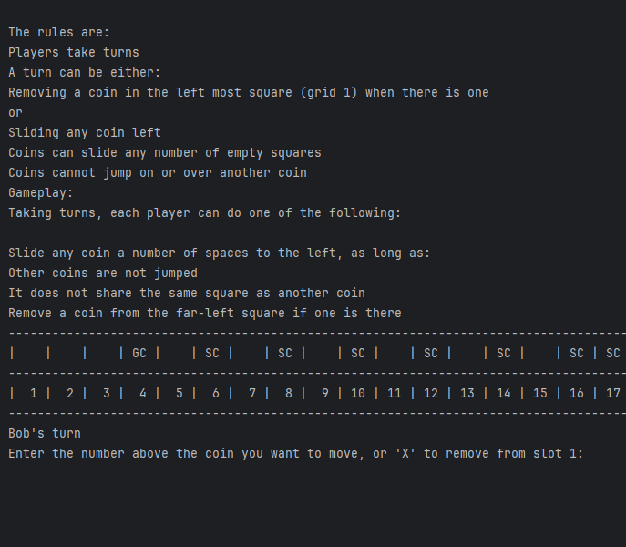

# Results of Testing

The test results show the actual outcome of the testing, following the [Test Plan](test-plan.md)

---

## Player names

Test if player names are displayed 

### Test Data Used

running the code to see if player names are displayed 

### Test Result

It worked better than expected 

---

## Check swap

Test for coin swaps

### Test Data Used

Testing to see if player input actually makes a difference 

### Test Result

The selected coins as expected swapped places with selected destinations

---
## Check turns 

Testing for player name display when taking turns 

### Test Data Used

Testing to see if player names are displayed when different players take turns

### Test Result

The game displays the current players name with the current move

---
## Check moves

Testing to see if players can make moves

### Test Data Used

Testing to see if player input can move or remove coins 

### Test Result

The game follows through with the current players move

---
## Check win

Testing to see if a player can win

### Test Data Used

Testing to see if players can win

### Test Result

The current player who removes the gold coin wins the game

---

